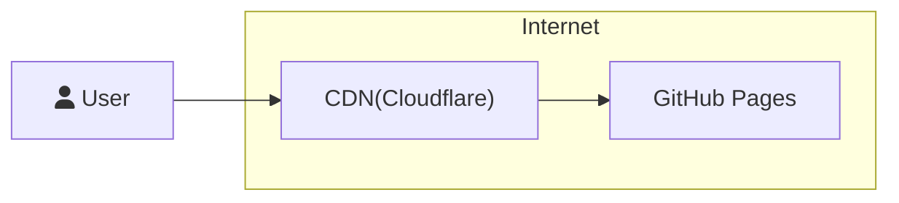
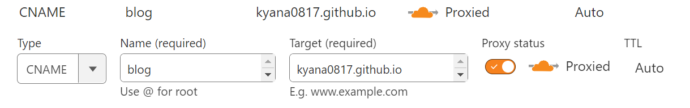
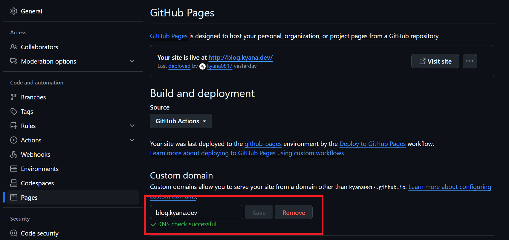

GitHub PagesでホスティングされたAstroフレームワークによって構築された静的Webページです。  
CI/CDにGitHub Actionsを利用しており、[Astro公式ドキュメント](https://docs.astro.build/en/guides/deploy/github/#configure-a-github-action)で紹介されているYAMLを少し修正して利用しています。  
ドメインはCloudflareで管理しているものを使用しており、サブドメインをGitHub Pagesに向けることでカスタムドメインを実現しています。

## Astro設定


```js
// astro.config.mjs
// @ts-check
import { defineConfig } from 'astro/config'
import mdx from '@astrojs/mdx'
import sitemap from '@astrojs/sitemap'
import expressiveCode from 'astro-expressive-code'
import remarkMermaid from 'remark-mermaidjs'

// https://astro.build/config
export default defineConfig({
  site: 'https://blog.kyana.dev',
  markdown: {
    remarkPlugins: [remarkMermaid],
  },
  integrations: [
    expressiveCode({
      themes: ['github-dark'],
    }),
    mdx(),
    sitemap(),
  ],
})

```

Astroの設定はほぼデフォルトで、mermaidの出力とコードブロックの表現力を上げるプラグインの2つを追加しています。

## 配信構成

GitHub Pagesに使用しているカスタムドメインはCloudflareで管理しているドメインのサブドメインを使用しています。  
この場合Cloudflare側の設定は、とりあえずダッシュボードからDNSレコードを追加し、タイプを`CNAME`に、Targetを`<username>.github.io`に設定するだけです。  
(あくまで最低限の設定)



Astro側は、publicディレクトリに使用するドメイン名を記載したCNAMEを作成します。
```
// /public/CNAME
blog.kyana.dev
```

GitHub側はリポジトリの設定画面から、PagesのCustom domainに先ほど追加したDNSレコードに対応するドメイン名を指定すれば良いです。  
DNSとの疎通が確認できれば、緑色のチェックマークが付きます。



私の環境ではCloudflareの設定変更直後はDNSのチェックに失敗していたが、大体5分ぐらい経ったところで無事に緑色のチェックマークが付きました。

## 維持コスト
このサイトの維持コストはAstroとCloudflareでほとんど完結しており、ドメイン管理費を除いて1円も掛かっていない。  
今後掛かる可能性があるとすれば、画像配信を別途サービスを使用する場合ぐらいだと思う。
